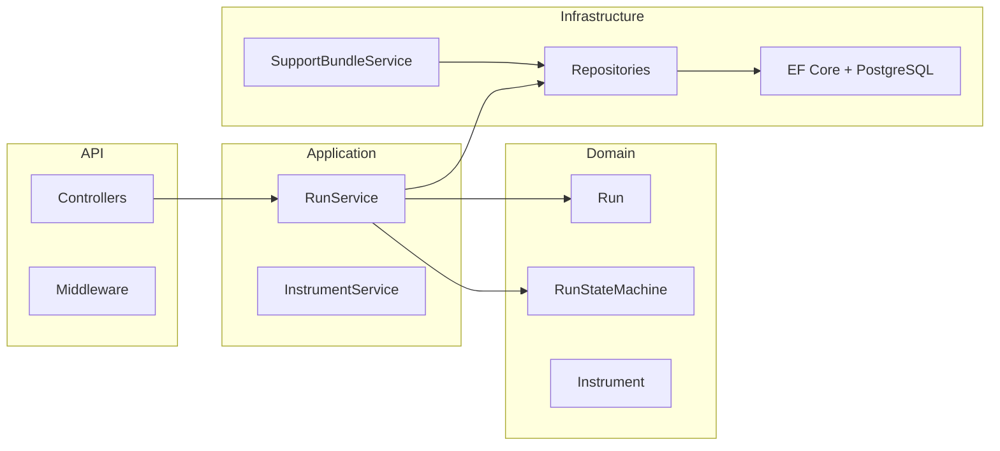

# Telemetry codebase overview and showcase plan

## Part 1: What this codebase is and what it does

### Purpose

This is a **.NET 8 Telemetry API** for managing:

- **Instruments** – Devices or systems that produce data (e.g. lab equipment). You register them and can check health.
- **Runs** – Execution jobs tied to an instrument and a sample (e.g. batch/specimen). Each run has a strict lifecycle.
- **Timeline** – Ordered events for each run (queued at, started at, etc.), giving an audit trail.
- **Support bundles** – For any run, you can download a ZIP containing metadata, timeline, environment info, and optional logs for offline debugging.

The main value is **reliable run lifecycle and traceability**: invalid state transitions are rejected with **409 Conflict** and a clear message; every transition is stored as an event; support bundles give a point-in-time snapshot for reproduction or investigation.

### Architecture (high level)

- **Domain** ([Telemetry.Domain](src/Telemetry.Domain)): Entities (`Run`, `Instrument`, `RunEvent`, `Alarm`), value objects (`SampleId`, `MethodMetadata`), and **RunStateMachine** (defines allowed transitions). No framework or DB dependencies.
- **Application** ([Telemetry.Application](src/Telemetry.Application)): Services (`RunService`, `InstrumentService`), DTOs, repository contracts. Orchestrates domain and persistence.
- **Infrastructure** ([Telemetry.Infrastructure](src/Telemetry.Infrastructure)): EF Core + PostgreSQL, repository implementations, **SupportBundleService** (builds the ZIP).
- **API** ([Telemetry.Api](src/Telemetry.Api)): Controllers, correlation-ID middleware, exception-handling middleware (maps `KeyNotFoundException` → 404, `InvalidOperationException` → 409, `ArgumentException` → 400). Swagger in Development.

Run lifecycle is enforced in the domain ([Run.cs](src/Telemetry.Domain/Entities/Run.cs), with transition checks delegated to [RunStateMachine](src/Telemetry.Domain/StateMachine/RunStateMachine.cs). The API currently exposes: create run, queue, start, cancel, get run, get timeline, and create support bundle. **Complete** and **Fail** exist in the domain but are not exposed as HTTP endpoints.

### What it is good for

- **Lab / instrument management**: Register instruments, track runs per sample and method.
- **Run orchestration**: Queue → start → (complete/fail/cancel) with clear state rules and no invalid transitions.
- **Audit and support**: Timeline of events per run; support bundle as a single artifact for debugging without live system access.
- **Learning / portfolio**: Clean layering, explicit state machine, event timeline, correlation ID, and good separation of concerns.

### Contexts where it could be used

- **Internal tools**: Dashboards or scripts that create runs, move them through states, and pull support bundles when something fails.
- **Trusted back-end**: Behind a gateway that enforces auth; the API itself has no authentication (see [README](README.md) and [docs/CRITICAL_REVIEW.md](docs/CRITICAL_REVIEW.md)).
- **Integration with instruments**: External systems (e.g. lab software) calling the API to create runs, queue, start, and optionally complete/fail (once those endpoints exist).
- **Demo/prototype**: Showing layered .NET design, state-machine-driven workflows, and support-bundle generation.

---

## Part 2: How to showcase what it does outside of tests

Today, behavior is demonstrated by:

- **Unit tests** – State machine and domain rules ([RunStateMachineTests](tests/Telemetry.UnitTests/StateMachine/RunStateMachineTests.cs), [RunTests](tests/Telemetry.UnitTests/Domain/RunTests.cs)).
- **Integration tests** – Full HTTP flow: create instrument → create run → queue → start → get run → get timeline ([RunsControllerTests](tests/Telemetry.IntegrationTests/RunsControllerTests.cs)), plus 409 when starting a non-queued run.
- **Swagger** – Available at `http://localhost:5244/swagger` when the API runs; good for ad-hoc exploration.

To **showcase** the system beyond “tests pass,” you can add one or more of the following.

### Option A: HTTP request collection (no code change)

- **Postman or Insomnia collection**: Export or hand-author a collection that:
  - Creates an instrument.
  - Creates a run (with optional method name/version).
  - Queues the run, then starts it.
  - Gets run and timeline.
  - Requests a support bundle (POST with optional `lastLogEntries`).
  - Optionally: call start without queue to show 409.
- **VS Code / .http file**: Add a `scripts` or `docs` folder with a `.http` file that does the same sequence. Anyone can run it with the REST Client extension against a running API.

This gives a repeatable, human-driven demo and documents the “happy path” and one error path.

### Option B: Minimal Dashboard wired to the API

The solution already includes a WPF app ([Telemetry.Dashboard](src/Telemetry.Dashboard)); [MainWindow.xaml.cs](src/Telemetry.Dashboard/MainWindow.xaml.cs) is effectively a stub. [CRITICAL_REVIEW.md](docs/CRITICAL_REVIEW.md) recommends implementing at least a minimal dashboard that lists runs, triggers actions (queue, start, cancel), and shows state/timeline.

- **Scope**: List instruments; create a run for a chosen instrument/sample; show run state and timeline; buttons for queue / start / cancel (and optionally complete/fail if you add those endpoints); “Download support bundle” that calls the API and saves the ZIP.
- **Config**: Base URL (e.g. `http://localhost:5244`) from config or input so it works against local or a known environment.

This showcases the API in a real UI and makes the lifecycle and support bundle tangible for non-developers.

### Option C: Demo script (PowerShell or bash)

- A script that:
  - Assumes the API is running (and optionally PostgreSQL via Docker).
  - Uses `curl` or `Invoke-RestMethod` to: create instrument → create run → queue → start → get run → get timeline → create support bundle and save to a file.
  - Prints state after each step and the path to the downloaded ZIP.
- Can live under `scripts/` (e.g. `scripts/demo-api.ps1` or `scripts/demo-api.sh`) and be referenced from the README.

Useful for quick demos and CI-style “smoke” runs without the full integration test stack.

### Option D: README “Try it” / demo section

- Add a short subsection to [README.md](README.md) that:
  - Points to Swagger and lists the exact sequence: create instrument, create run, queue, start, get run, get timeline, support bundle.
  - Optionally includes 1–2 sample `curl` commands (e.g. create instrument, create run) so someone can paste and run.
  - Mentions the optional `X-Correlation-Id` header for tracing.

This doesn’t require new artifacts but makes the “first run” path obvious and positions Swagger as the primary way to try the API.

### Recommendation

- **Minimum**: Option D (README demo + Swagger) plus Option A (Postman or `.http` file) so there is a documented, repeatable sequence without writing new application code.
- **Stronger showcase**: Add Option B (minimal Dashboard) so the run lifecycle and support bundle are visible in a UI; this aligns with the existing CRITICAL_REVIEW recommendation.
- **Convenience**: Option C (script) is optional but useful for quick demos and for readers who prefer command-line over Swagger.

---

## Summary

| Aspect                    | Summary                                                                                                              |
| ------------------------- | -------------------------------------------------------------------------------------------------------------------- |
| **What it is**            | .NET 8 Web API for instruments, runs (with strict lifecycle), event timeline, and support-bundle ZIPs.               |
| **Good for**              | Lab/instrument and run orchestration, audit trail, support debugging, and clean-architecture/state-machine examples. |
| **Contexts**              | Internal tools, trusted back-end behind auth gateway, instrument integration, demos.                                 |
| **Showcase beyond tests** | Swagger (existing) + README demo (D) + HTTP collection (A); optionally Dashboard (B) and/or demo script (C).         |
