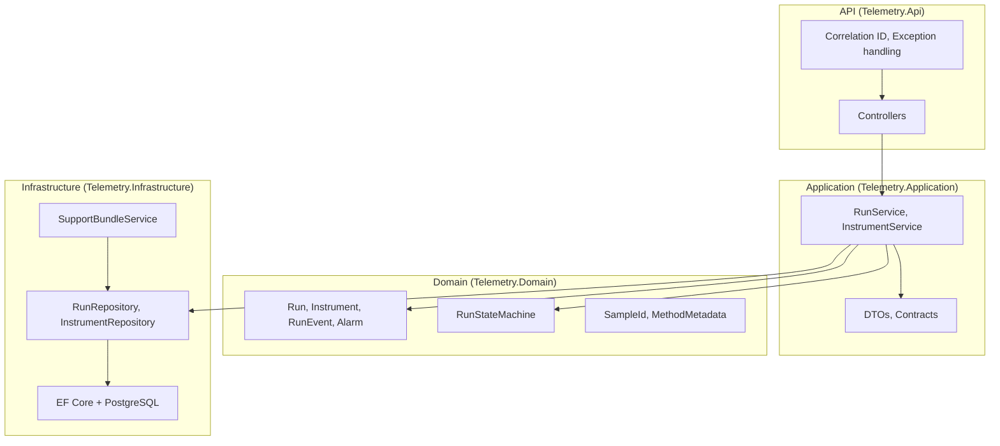
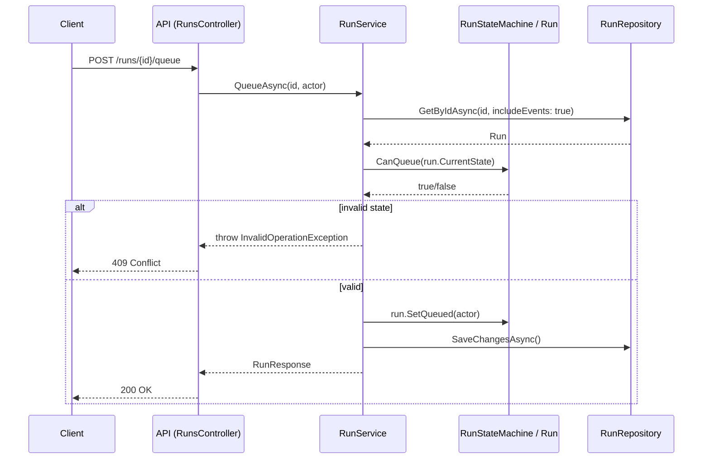
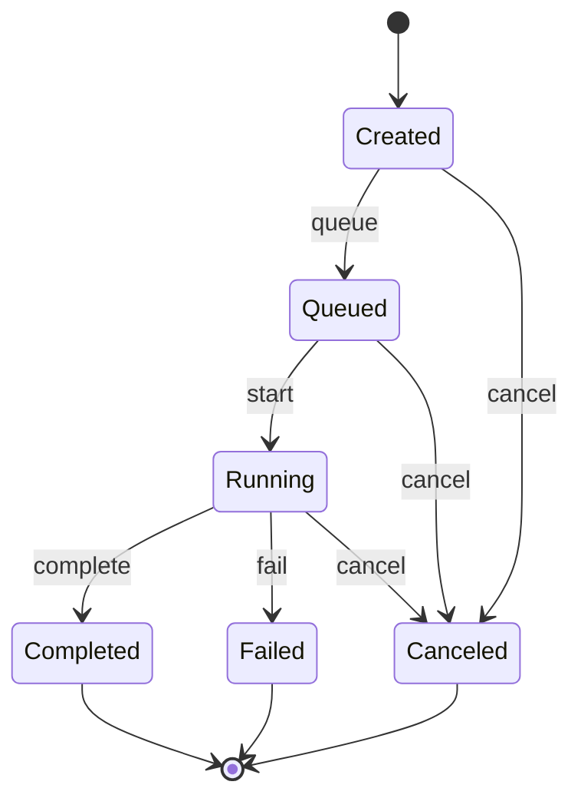

# Telemetry API

A .NET 8 Web API for managing **instruments** (devices or systems that produce data), **runs** (execution jobs tied to a sample and method), and **support bundles** for debugging. Runs follow a strict lifecycle so you can reliably queue, start, complete, fail, or cancel them—and capture a point-in-time snapshot (metadata, timeline, environment, logs) when something goes wrong.

---

## What this project does

- **Instruments** – Register devices or systems. Track health and alarms.
- **Runs** – Each run belongs to an instrument and a sample (e.g. a batch or specimen). You create a run, then move it through: **Created → Queued → Running** and finally **Completed**, **Failed**, or **Canceled**. Every transition is recorded as an event with a timestamp and optional actor.
- **Timeline** – Ordered list of events for a run (queued at, started at, completed at, etc.).
- **Support bundle** – For any run you can download a ZIP containing metadata, timeline, environment info, and optional logs. Use it to reproduce or investigate issues without hitting the live system.

Invalid transitions (e.g. starting a run that is still Created) are rejected with **409 Conflict** and a clear message so clients and operators know exactly why an action was refused.

---

## How it works

### Architecture: layers

The solution is split into layers so the core business rules live in the domain, use cases in the application layer, and HTTP and persistence in the outer layers.



- **API** – HTTP entrypoint. Controllers call application services; middleware adds correlation IDs and maps exceptions to HTTP status codes.
- **Application** – Orchestrates the domain and repositories. Validates transitions with the state machine, loads/saves entities, returns DTOs.
- **Domain** – Entities, value objects, and the run state machine. No dependencies on frameworks or databases.
- **Infrastructure** – EF Core with PostgreSQL, repository implementations, and the support-bundle ZIP builder.

### Request flow (example: queue a run)



1. Controller receives the request and calls `RunService.QueueAsync`.
2. Service loads the run (with events) from the repository.
3. Service asks the **state machine** whether the current state allows transitioning to Queued (only **Created** does).
4. If allowed, the service calls `run.SetQueued(actor)` (domain records the transition and a new event), then persists via the repository.
5. Exceptions (e.g. run not found, invalid state) are turned into 404/409 by the exception-handling middleware.

### Run state machine

Runs can only move along allowed transitions. Terminal states (Completed, Failed, Canceled) have no outgoing transitions.



| From     | Allowed actions        | To        |
|----------|------------------------|-----------|
| Created  | queue, cancel           | Queued, Canceled |
| Queued   | start, cancel           | Running, Canceled |
| Running  | complete, fail, cancel | Completed, Failed, Canceled |
| Completed, Failed, Canceled | — | (terminal) |

---

## Why these choices

- **Layered architecture** – Keeps business logic in one place (domain + application), makes testing and swapping persistence or API style easier.
- **Explicit state machine** – Run lifecycle is central to the product. A dedicated `RunStateMachine` and transition checks make invalid states impossible at the application layer and keep behavior consistent and testable.
- **Event timeline** – Every state change is stored as a `RunEvent`. That gives an audit trail and a clear “what happened when” for support bundles and debugging.
- **PostgreSQL + EF Core** – Relational model fits instruments, runs, events, and alarms; EF Core handles migrations and keeps the repository abstraction simple.
- **Support bundle as a ZIP** – Single artifact (metadata, timeline, environment, optional logs) that can be opened offline and shared without needing live access to the API or database.
- **Correlation ID** – Optional header (`X-Correlation-Id`) ties all requests for a run together in logs and in the support bundle, so you can trace a full session.

---

## Prerequisites

- .NET 8 SDK  
- Docker (for local PostgreSQL and for integration tests)

---

## Run locally

1. **Start PostgreSQL** (app uses host port **5433** to avoid clashing with a local PostgreSQL on 5432):

   ```bash
   docker compose up -d
   ```

   Wait a few seconds for the container to be ready.

2. **Apply migrations** (from repo root):

   ```bash
   dotnet ef database update --project src/Telemetry.Infrastructure --startup-project src/Telemetry.Api
   ```

3. **Run the API**:

   ```bash
   dotnet run --project src/Telemetry.Api
   ```

4. **Open Swagger**: **http://localhost:5244/swagger**

   For HTTPS: `dotnet run --project src/Telemetry.Api --launch-profile https`, then https://localhost:7254/swagger.

---

## API overview

| Method | Endpoint | Description |
|--------|----------|-------------|
| POST | `/instruments` | Create an instrument |
| GET | `/instruments/{id}/health` | Instrument health and alarms |
| POST | `/runs` | Create a run (instrument, sample, optional method metadata) |
| POST | `/runs/{id}/queue` | Move run from Created → Queued |
| POST | `/runs/{id}/start` | Move run from Queued → Running |
| POST | `/runs/{id}/cancel` | Cancel from Created, Queued, or Running |
| GET | `/runs/{id}` | Run state and metadata |
| GET | `/runs/{id}/timeline` | Ordered event timeline |
| POST | `/runs/{id}/support-bundle` | Download ZIP (metadata, timeline, environment, optional logs) |

Use the same `X-Correlation-Id` header across requests to trace a run in logs and support bundles.

---

## Testing

- **Unit tests** (domain and state machine; no Docker):

  ```bash
  dotnet test tests/Telemetry.UnitTests/Telemetry.UnitTests.csproj
  ```

- **Integration tests** (API with Testcontainers PostgreSQL; Docker required):

  ```bash
  dotnet test tests/Telemetry.IntegrationTests/Telemetry.IntegrationTests.csproj
  ```

- **All tests**:

  ```bash
  dotnet test
  ```

---

## Limitations and security

This API has **no authentication or authorization**. It is intended for **trusted or internal use** (e.g. local development, internal tools, or behind a gateway that enforces auth). Do not expose it directly to the internet without adding authentication and authorization.

Connection string must be provided via configuration (e.g. `appsettings.json`, User Secrets, or environment variables). For a detailed list of security, maintainability, and scalability findings and recommendations, see **[docs/CRITICAL_REVIEW.md](docs/CRITICAL_REVIEW.md)**.

---

## Troubleshooting

- **28P01 / password authentication failed for user "postgres"** – The app expects PostgreSQL on **port 5433** (see `docker-compose.yml` and `appsettings.json`). If you have another PostgreSQL on 5432, either use port 5433 for this app or set `ConnectionStrings__DefaultConnection` to match your server (host, port, user, password).
- **409 on queue/start/cancel** – The run is not in an allowed state. Use `GET /runs/{id}` to see its state and the state machine rules above.
- **Integration tests fail** – Docker must be running (e.g. Docker Desktop on Windows).

---

## CI

GitHub Actions (`.github/workflows/ci.yml`) runs on push and pull requests to `main`: restore → build (Api + unit + integration test projects only; Windows-only projects like Dashboard are skipped on Linux) → unit tests → integration tests (Testcontainers) → publish test results.
